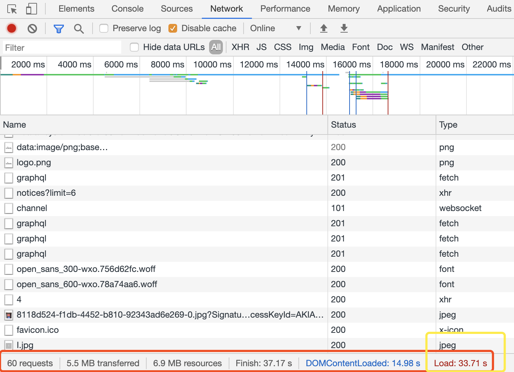

# Augest-2019

## 1

### JS之let与const

---

[参考文档](http://es6.ruanyifeng.com/#docs/let)
```javascript

var a=[];
for (var i=0 ; i<10 ; i++){
    a[i] = function(){
        console.log(i);
    }
}
a[6]();//10
```
`var`声明的`i`在全局范围内都有效，循环内被赋给数组`a`的函数内部的`console.log(i)`，里面的`i`指向的就是全局的`i`。也就是说，所有数组`a`的成员里面的`i`，指向的都是同一个`i`，自然导致运行时输出的是最后的`i`的值。

```js
var b=[];
for (let j=0 ; j<10 ; j++){
    b[j] = function(){
        console.log(j);
    }
}
b[6]();//6
```
`let`声明的变量只在当前代码块作用域有效，当前的`j`只在本轮循环有效，所以每一次循环的`j`其实都是一个**新的变量**。这基于 *JavaScript* 引擎内部会记住上一轮循环的值，初始化本轮的变量`j`时，就在上一轮循环的基础上进行计算。

---

```js
console.log(foo); //undefined
var foo=2;

console.log(bar); //ReferenceError
let bar=2;
```

脚本运行时，`foo`变量存在，但是没有值，在这里发生了变量提升；而`bar`确实不存在的。

---

`let`会导致出现*暂时性死区* (**temporal dead zone**)

```js
var tmp=123;
if(true){
    tmp = "abc"; //ReferenceError
    let tmp;
}
```
**ES6** 明确规定，如果区块中存在`let`和`const`命令，这个区块对这些命令声明的变量，从一开始就形成了封闭作用域。凡是在声明之前就使用这些变量，就会报错。

---

```js
function func1(){
    var a=1;
    var a=2;
}
func1();//2

function func2(){
    var b=1;
    let b=1; //ReferenceError
}
func2();//Uncaught SyntaxError: Identifier 'a' has already been declared
```
---

- const 声明一个只读变量，并在声明的时候赋值，一旦赋值则不可更改。
- const的作用域与let命令相同：只在声明所在的块级作用域内有效
- const命令声明的常量也是不提升，同样存在暂时性死区，只能在声明的位置后面使用。
- const声明的常量，也与let一样不可重复声明。

const实际上保证的，并不是变量的值不得改动，而是变量指向的那个内存地址所保存的数据不得改动。


## 6

### 变量的结构赋值

---
```js
var [head,,...tail] = [1,2,3,4,5];
console.log(head);//1
console.log(tail);//[3,4,5]
```

本质上，这种写法属于“模式匹配”，只要等号两边的模式相同，左边的变量就会被赋予对应的值。

```js
let [x, y, ...z] = ['a'];
console.log(x); // "a"
console.log(y); // undefined
console.log(z); // []

let [a, [b], d] = [1, [2, 3], 4];
console.log(a); // 1
console.log(b); // 2
console.log(d); // 4
```

如果等号的右边不是数组（或者严格地说，不是可遍历的结构），那么将会报错。

解构赋值允许指定默认值:
```js
let [x, y = 'b'] = ['a', undefined]; // x='a', y='b'
let [x = 1] = [null];//x = null;  null!==undefined
```
注意，ES6 内部使用严格相等运算符`（===）`，判断一个位置是否有值。所以，只有当一个数组成员严格等于`undefined`，默认值才会生效。

如果默认值是一个表达式，那么这个表达式是惰性求值的，即只有在用到的时候，才会求值:
```js
f(){
    console.log("***");
}
let [a = f()] = [1];// a=1
```
---

对象的解构与数组有一个重要的不同。数组的元素是按次序排列的，变量的取值由它的位置决定；而对象的属性没有次序，**变量必须与属性同名**，才能取到正确的值。
```js
let { bar, foo } = { foo: 'aaa', bar: 'bbb' };
foo // "aaa"
bar // "bbb"
```

对象的解构赋值，可以很方便地将现有对象的方法，赋值到某个变量。
```js
let { log, sin, cos } = Math;
//将Math对象的对数、正弦、余弦三个方法，赋值到对应的变量上
//自动按照对象名匹配

const { log } = console;
log('hello') // hello
```

与数组一样，解构也可以用于嵌套结构的对象。
```js
let obj = {
  p: [
    'Hello',
    { y: 'World' }
  ]
};

let {p: [x, { y }] } = obj;
x // "Hello"
y // "World"
```
注意，这时p是模式，不是变量，因此不会被赋值。如果p也要作为变量赋值，可以写成下面这样。
```js
let obj = {
  p: [
    'Hello',
    { y: 'World' }
  ]
};

let { p, p: [x, { y }] } = obj;
x // "Hello"
y // "World"
p // ["Hello", {y: "World"}]
```

对象的解构也可以指定默认值。也需要判断严格相等`undefined`。

**注意**

```js
let x;
{x} = {x: 1};//Uncaught SyntaxError: Unexpected token =

//正确形式
let x;
({x} = {x : 1}); //x=1;
```
因为将`{`写在了行首，JS引擎将会解析为代码块。故应当采取下面的形式。

---

由于数组本质是特殊的对象，因此可以对数组进行对象属性的解构:
```js
let arr = [1, 2, 3];
let {0 : first, [arr.length - 1] : last} = arr;
//方括号这种写法，属于“属性名表达式”

first // 1
last // 3
```

---

字符串也可以解构赋值。这是因为此时，字符串被转换成了一个类似数组的对象。
```js
const [a, b, c, d, e] = 'hello';
a // "h"
b // "e"
c // "l"
d // "l"
e // "o"
```
类似数组的对象都有一个length属性，因此还可以对这个属性解构赋值:
```js
let {length : len} = 'hello';
len // 5
//将string类型的length属性对应的值赋值给len
```
---

## 21

### 优化网页加载速度

#### 参考文献
[完整攻略！让你的网页加载时间降低到 1s 内！
](https://juejin.im/entry/57a7d030128fe100548b5b9c)

#### 问题描述



#### 基本知识

一个网页的加载流程大致如下：
> 1、解析HTML结构。  
2、加载外部脚本文件和样式表文件。  
3、解析并执行脚本代码。 // 部分脚本会阻塞页面的加载  
4、DOM树构建完成。 //DOMContentLoaded 事件  
5、加载图片等外部文件。  
6、页面加载完毕。 //load 事件

理论分析耗时部分：
> 1、发送http请求需要时间  
> 2、文件传输带来的网络延迟  
> 3、解析和执行脚本代码需要时间  
> 4、渲染页面需要时间

===>  优化网页的加载速度：**减少请求数量、减小请求大小**。