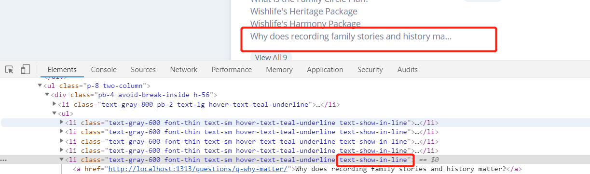
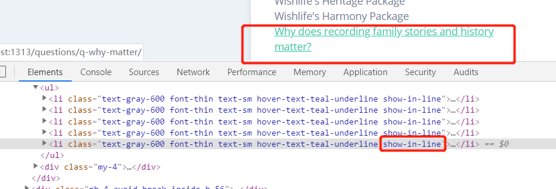

# July-2019

## 18

### question 1 

今天又碰到了chrome无法正确加载CSS的问题了，只不过改了类选择器的名称，就无法正确渲染。

最开始类选择器的名称是`text-show-in-line`



想着修改一下名称为`show-in-line`但是却导致无法加载CSS，当然不是只改标签的类名而不该CSS的问题了



清理chrome缓存就好了


那么问题来了，CSS怎么保证文字在一行显示，多余的文字被省略处理呢？
```css
.one-line{
  overflow: hidden;
  text-overflow: ellipsis;
  display: -webkit-box;
  -webkit-box-orient: vertical;
  -webkit-line-clamp: 1;
  line-height: 1.2rem;
  max-height: 1.2rem;
}
```

## 22

### question 1

HUGO 设置{{.Page.Lastmod}} 参数的时候，因为将`enableGitInfo = "true"` 放在了两个`list`(`[]`)之间，使得无法正常获取到{{.GitInfo}}

## 23


## 24

### question 1

因filename 带有 ''' 符号，导致某个content中{{.Page.Lastmod}}无法正常显示


### 25

### question 1

`brew install node` 时又出现了network problems，uninstall 之后再install还是Error，google之后参考了[issure](https://github.com/Homebrew/brew/issues/3228)，设置了`sudo chown -R $(whoami) $(brew --prefix) `。
```
Ilooker-MacBook-Pro:~ Ilooker$ brew install node
==> Downloading https://homebrew.bintray.com/bottles/node-12.6.0.mojave.bottle.t
Already downloaded: /Users/Ilooker/Library/Caches/Homebrew/downloads/8f5abe0478c1138b79dae904b9ec31f70d39653a129a1a797eec00fff09aedef--node-12.6.0.mojave.bottle.tar.gz
==> Pouring node-12.6.0.mojave.bottle.tar.gz
Error: The `brew link` step did not complete successfully
The formula built, but is not symlinked into /usr/local
Could not symlink bin/node
Target /usr/local/bin/node
already exists. You may want to remove it:
  rm '/usr/local/bin/node'

To force the link and overwrite all conflicting files:
  brew link --overwrite node

To list all files that would be deleted:
  brew link --overwrite --dry-run node

Possible conflicting files are:
/usr/local/bin/node
/usr/local/include/node/common.gypi
/usr/local/include/node/config.gypi
...
/usr/local/lib/dtrace/node.d
Warning: The post-install step did not complete successfully
You can try again using `brew postinstall node`
==> Caveats
Bash completion has been installed to:
  /usr/local/etc/bash_completion.d
==> Summary
🍺  /usr/local/Cellar/node/12.6.0: 4,515 files, 53.0MB
Ilooker-MacBook-Pro:~ Ilooker$ brew postinstall node
==> Postinstalling node
Warning: The post-install step did not complete successfully
You can try again using `brew postinstall node`
Ilooker-MacBook-Pro:~ Ilooker$ brew postinstall node
==> Postinstalling node
Warning: The post-install step did not complete successfully
You can try again using `brew postinstall node`
Ilooker-MacBook-Pro:~ Ilooker$ sudo chown -R $(whoami) $(brew --prefix)/*
Password:
Ilooker-MacBook-Pro:~ Ilooker$ brew uninstall node
Uninstalling /usr/local/Cellar/node/12.6.0... (4,515 files, 53.0MB)
Ilooker-MacBook-Pro:~ Ilooker$ brew install node
==> Downloading https://homebrew.bintray.com/bottles/node-12.6.0.mojave.bottle.t
Already downloaded: /Users/Ilooker/Library/Caches/Homebrew/downloads/8f5abe0478c1138b79dae904b9ec31f70d39653a129a1a797eec00fff09aedef--node-12.6.0.mojave.bottle.tar.gz
==> Pouring node-12.6.0.mojave.bottle.tar.gz
Error: The `brew link` step did not complete successfully
The formula built, but is not symlinked into /usr/local
Could not symlink bin/node
Target /usr/local/bin/node
already exists. You may want to remove it:
  rm '/usr/local/bin/node'

To force the link and overwrite all conflicting files:
  brew link --overwrite node

To list all files that would be deleted:
  brew link --overwrite --dry-run node

Possible conflicting files are:
/usr/local/bin/node
/usr/local/include/node/common.gypi
/usr/local/include/node/config.gypi
...
/usr/local/lib/dtrace/node.d
==> Caveats
Bash completion has been installed to:
  /usr/local/etc/bash_completion.d
==> Summary
🍺  /usr/local/Cellar/node/12.6.0: 4,515 files, 53.0MB
Ilooker-MacBook-Pro:~ Ilooker$ node -v
v10.15.3
Ilooker-MacBook-Pro:~ Ilooker$ 
```

最后通过这个[StackOverflow](https://stackoverflow.com/questions/12607155/error-the-brew-link-step-did-not-complete-successfully)解决了问题。

```
[Ilooker-MacBook-Pro:~ Ilooker$ brew install node
==> Downloading https://homebrew.bintray.com/bottles/node-12.6.0.mojave.bottle.t
Already downloaded: /Users/Ilooker/Library/Caches/Homebrew/downloads/8f5abe0478c1138b79dae904b9ec31f70d39653a129a1a797eec00fff09aedef--node-12.6.0.mojave.bottle.tar.gz
==> Pouring node-12.6.0.mojave.bottle.tar.gz
==> Caveats
Bash completion has been installed to:
  /usr/local/etc/bash_completion.d
==> Summary
🍺  /usr/local/Cellar/node/12.6.0: 4,515 files, 53.0MB
Ilooker-MacBook-Pro:~ Ilooker$ node -v
v12.6.0
Ilooker-MacBook-Pro:~ Ilooker$ npm -v
6.9.0
Ilooker-MacBook-Pro:~ Ilooker$ yarn -v
1.16.0

```